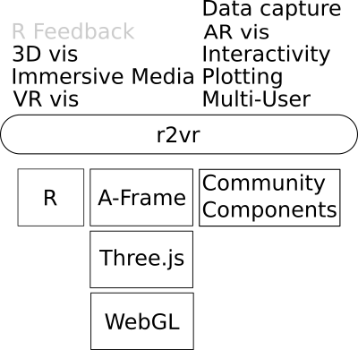
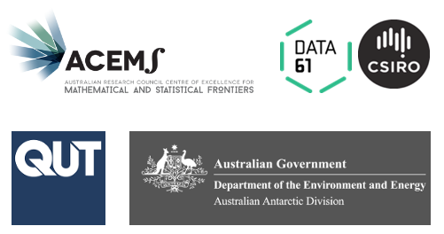

Row
--------------------------------------------------------------------------------

### A Bridge to WebVR {data-width=500}
The maturing Web Virtual Reality (WebVR) ecosystem presents scientists with versatile
platform for conducting experiments and communicating their work. However, current open tools for this medium require familiarity with either games development (Unity) or web development (React 360, A-Frame).

We present an R package, `r2vr`, that provides scientists and storytellers with a
bridge to WebVR via R using Mozilla's A-Frame HTML framework.

 

</img>

 

#### More Information

* `r2vr` 
  - view syntax and gallery: https://www.github.com/milesmcbain/r2vr
  - read posts about it: https://milesmcbain.xyz/r2vr
  - install it: `devtools::install_github("milesmcbain/r2vr")`
* A-Frame
  - demos: https://aframe.io
  - tutorial: https://aframe.io/aframe-school/
* This poster + vis: https://github.com/milesmcbain/acp_vr_vis

#### Acknowledgements
Bridging scientific computing and VR is a project funded by ACEMS in partnership with CSIRO Data 61, at Queensland University of Technology. Specialist support has been provided in-kind by the Australian Antarctic Division.

  </img>

 
### Alexander Clark Park Koala Survey {data-width=500}

<iframe id="acp" title="WebVR Vis" src="http://127.0.0.1:8081"
    width="800" height ="600"></iframe>

Urban pressure on Queenland's Koalas. This isolated colony in Alexander
Clark Park, south-west of Brisbane is at high risk of mortality from pet attacks
and other human related causes.

 

In this ACEMS project Virtual Reality is being used to immerse Koala experts in
habitat imagery to elicit priors for Bayesian spatial models of habitat
suitability and species distribution.

This WebVR visualisation was developed entirely in R using `r2vr`, involving:

* Elevation data from Geosciences Australia (raster)
* Satellite imagery from Google maps (image)
    - *(c) CNES / Airbus, DigitalGlobe*
* 3D model by Google (https://poly.google.com) (gltf)
* Koala survey data from Queensland Department of Environment and Heritage Protection (csv)
* 360 degree image survey by ACEMS. (image)
